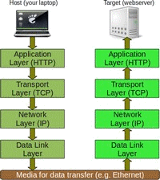

<!---
template: umuc_courses
crsTitle: CMST385 • Web Design and Technology
--->   

<h1 id="Week0" class="week">Welcome to CMST 385</h1>

This is a classic Face-to-Face class and we meet entirely in person. There will be no online discussions and if you have a question you can ask in class or email me at  

I will post handouts and hyperlinks to videos for the class on this web page which is accessible through the URL [http://rlaurie.pancakeapps.com/c385/](http://rlaurie.pancakeapps.com/c385/ "Right click this link and open in new tab")

Please bookmark (favorites) this URL in your browser so that you can easily return to it as the course progresses.

### So lets get started...
 
The course has as a prerequisite of either IFSM201 or CMIS102 to insure students come into the class with intermediate computer skills.  This course has a final exam so it is important that you learn HTML and CSS coding so you do well on the assignments and exam.

The primary references for the class will be the following web sites:

+ [www.w3schools.com/html/](http://www.w3schools.com/html/ "Right click this link and open in new tab") a great reference for both HTML and CSS
+ [http://www.littlewebhut.com/html/](http://www.littlewebhut.com/html/ "Right click this link and open in new tab") a good reference with tutorial videos
+ [learn.shayhowe.com/](http://learn.shayhowe.com/ "Right click this link and open in new tab") created by a professional web developer. 

UMUC no longer utilizes books for their courses, because free online resources have been setup for the course as can be viewed at [LEO](http://campus.umuc.edu/ "Right click this link and open in new tab").

However, you may enjoy the course more if you purchase the book _Learn to Code HTML & CSS_ that is available through [Amazon](http://www.amazon.com/gp/product/0321940520 "Right click this link and open in new tab") as either [paperback](http://www.amazon.com/Learn-Code-HTML-CSS-Websites/dp/0321940520/ref=tmm_pap_swatch_0?_encoding=UTF8 "Right click this link and open in new tab") or [ebook](http://www.amazon.com/Learn-Code-HTML-CSS-Websites-ebook/dp/B00JVQX7V8/ref=mt_kindle?_encoding=UTF8 "Right click this link and open in new tab"). We will be using the author's [web site](http://learn.shayhowe.com/ "Right click this link and open in new tab") as one of the resources for the course. Most of the information in the book is on his web site  [learn.shayhowe.com/](http://learn.shayhowe.com/ "Right click this link and open in new tab"), but a book is often more convenient, especially if you have only one computer screen to work on assignments.

Print all Week 1 materials described below that are posted as PDF files. I recommend using the freeware version of [PDFXChangeViewer](http://www.docu-track.com/home/prod_user/PDF-XChange_Tools/pdfx_viewer "Right click this link and open in new tab"), which allows you to make notes and save them to any PDF file or you can use Adobe Acrobat Reader.

All software used in this class is freeware and I strive to find software that can be run on all common operating systems (Windows, MacOSX, Linux). 

I recommend that you get started with Week 1 content today, by clicking Week 1 in the navigation bar above or scrolling down.

Robert Laurie

<h2 id="Week1" class="week">Week 1: Internet, World Wide Web, and HTML</h2>
  
 The first week is primarily lecture with some hands on setup and HTML coding is required for Assignment 1. The first class will cover a general explanation of the terminology, components that make up the Internet, and World Wide Web. You will be learning HTML5 and CSS3 coding in this class and you are expected to use these standards for all assignments in the class.

**Read LEO > Week 1 > Introduction to the Internet** 

[www.w3schools.com](http://www.w3schools.com/ "Right click this link and open in new tab") is an excellent tutorial and reference web site that will be used as the primary source of information. They offer certificates for $95 if you are looking for a certificate in this area.
 
Please read and work through the first 7 chapters of [www.w3schools.com - HTML(5) Tutorial](http://www.w3schools.com/html/default.asp "Right click this link and open in new tab") prior to the first class.

 1. [HTML Introduction](http://www.w3schools.com/html/html_intro.asp "Right click this link and open in new tab") 
 1. [HTML Editors](http://www.w3schools.com/html/html_editors.asp "Right click this link and open in new tab") 
 1. [HTML Basic](http://www.w3schools.com/html/html_basic.asp "Right click this link and open in new tab")
 1. [HTML Elements](http://www.w3schools.com/html/html_elements.asp "Right click this link and open in new tab")  
 1. [HTML Attributes](http://www.w3schools.com/html/html_attributes.asp "Right click this link and open in new tab")
 1. [HTML Headings](http://www.w3schools.com/html/html_headings.asp "Right click this link and open in new tab")
 1. [HTML Paragraphs](http://www.w3schools.com/html/html_paragraphs.asp "Right click this link and open in new tab") 
 
Bring your notebook computer to class, because there will be some class time for demonstration, hands-on coding, and asking questions. You also need to bring a USB Thumb Drive to class for storing and transferring computer files. 

I will utilize PowerPoint slides to introduce HTML and CSS concepts throughout the class. Please print the slide set and all posted PDF documents as they will be your primary source of information in the class. PowerPoint handouts are posted with four slides per page, and it is best to print in color so that you can see the syntax format of the code:

 + [Slide Set 1: Document and Block HTML Elements](01_IntroBlock.pdf "Right click this link and open in new tab") 
 + [HTML File Names Handout](HTMLFileNames.pdf "Right click this link and open in new tab")
 + [Writing Valid HTML](WritingValidHTML.pdf "Right click this link and open in new tab")
 + [Assignment 1: HTML - Part A](CMST385-A01ab.pdf "Right click this link and open in new tab") *Due August 30*
 
Software to download and install for the class:

 + [Firefox Browser by Mozilla](https://www.mozilla.org/en-US/firefox/desktop/ "Right click this link and open in new tab") (Windows, MacOSX, Linux)
   + [Html Validator Extension](https://addons.mozilla.org/en-US/firefox/addon/html-validator/)
 + [Komodo Edit](http://komodoide.com/komodo-edit/ "Right click this link and open in new tab") (Windows, MacOSX, Linux) is freeware and excellent Text Editor. It has code templates and code completion features for creating HTML documents. (Caution! Do not download Komodo IDE trial).
 + [Notepad++](https://notepad-plus-plus.org/ "Right click this link and open in new tab") (Windows) small and fast text editor for windows only. 
 + [DropBox](https://db.tt/iqJp1nOx) will be used used to store files and also as a web host. If you are not already a member of Dropbox, then please click [here](https://db.tt/iqJp1nOx "Right click this link and open in new tab").
    1. Download and install Dropbox to your home computers. 
    1. Create a login and password for Dropbox and don't forget it. 
	1. You will need to select one folder for Dropbox so make it easy to find. 
	1. Create a sub-folder called **CMST385_YourName**, where YourName is your name. Store all resource files for the course in this folder.  
 + [Pancake.io](https://www.pancake.io/ "Right click this link and open in new tab") is a great way to host a free website using DropBox.  
    - Uses DropBox sub folder located at **Dropbox\Apps\Pancake.io**. 
	- All files placed in the folder will be hosted as a static website.
    - yourURL.pancakeapps.com will be the URL for tout web site after setting up Pancake.io and linking to your DropBox. 

I have created a short 3 minute video about how to setup a Dropbox Pancake.io Web Sever available at <http://www.screencast.com/t/lPFiTbJs>

Videos available on YouTube for viewing this week:

 1. [How the Internet Works in 5 Minutes](https://youtu.be/7_LPdttKXPc "Right click this link and open in new tab")
 1. [Komodo Edit Tutorial - LearnToProgram](http://youtu.be/C43CVDidM84 "Right click this link and open in new tab")
 1. [Basic HTML #1 - Komodo Edit](http://youtu.be/06Y_rNjmIwc "Right click this link and open in new tab")
 1. [Dropbox Tutorial](https://youtu.be/gybe_YlpAe4 "Right click this link and open in new tab" "Right click this link and open in new tab")
 1. [LittleWebHut HTML5 Video Tutorial - Part 1 - The Basics](http://www.littlewebhut.com/html5/the_basics/ "Right click this link and open in new tab") 
 1. [LittleWebHut HTML5 Video Tutorial - Part 2 - Text ](http://www.littlewebhut.com/html5/text/ "Right click this link and open in new tab")
 1. [thenewboston HTML Tutorial - 2 - Creating our First Webpage](http://youtu.be/k3dJKtQmyd0 "Right click this link and open in new tab")
 1. [thenewboston HTML Tutorial - 3 - body and headers](http://youtu.be/JEacEPCxjl4 "Right click this link and open in new tab")
 1. [thenewboston HTML Tutorial - 4 - Paragraphs and Line Breaks](http://youtu.be/3R3QXXnF7FM "Right click this link and open in new tab")

<h2 id="Week2" class="week">Week 2: HTML - Inline, Lists, and Links</h2>

This week we will cover the topics of inline elements, symbols, and lists. Bring your notebook computer to class, because there will be some class time for demonstration, hands-on coding, and asking questions. You also need to bring a USB Thumb Drive to class for storing and transferring computer files.

**Read LEO > Week 2 > Planning and Creating Websites**

Continue to work through [www.w3schools.com - HTML(5) Tutorial](http://www.w3schools.com/html/default.asp). Read and work through the following 8 chapters prior to class this week: 

 1. [HTML Formatting](http://www.w3schools.com/html/html_formatting.asp "Right click this link and open in new tab") 
 1. [HTML Computercode](http://www.w3schools.com/html/html_computercode_elements.asp "Right click this link and open in new tab") 
 1. [HTML Comments](http://www.w3schools.com/html/html_comments.asp "Right click this link and open in new tab")
 1. [HTML Symbols](http://www.w3schools.com/html/html_symbols.asp "Right click this link and open in new tab")
 1. [HTML Entities](http://www.w3schools.com/html/html_entities.asp "Right click this link and open in new tab")
 1. [HTML Encoding (Character Sets)](http://www.w3schools.com/html/html_charset.asp "Right click this link and open in new tab") 
 1. [HTML Head](http://www.w3schools.com/html/html_head.asp "Right click this link and open in new tab")
 1. [HTML Lists](http://www.w3schools.com/html/html_lists.asp "Right click this link and open in new tab")
 1. [Browser popularity table](http://www.w3schools.com/browsers/browsers_stats.asp)
 1. [Browser support information](http://html5test.com/results/desktop.html)
 

Please print the slide set and all posted PDF documents as they will be your primary source of information in the class:

 + [Slide Set 2: Inline HTML Elements and Symbols](02_Inline_Symbols.pdf "Right click this link and open in new tab")
 + [Slide Set 3: Lists and HyperLinks](03_Lists_Links.pdf "Right click this link and open in new tab")
 + [Assignment 1: HTML - Part B](CMST385-A01ab.pdf "Right click this link and open in new tab") - *Due September 1*
 + [Assignment 1: HTML - Part C](CMST385-A01cde.pdf)  - *Due September 6*  use [BillOfRights.ascii](BillOfRights.ascii "Right click this file and save to your computer") 
 + [Assignment 1: HTML - Part D](CMST385-A01cde.pdf)  - *Due September 8*  
 + [Assignment 1: HTML - Part E](CMST385-A01cde.pdf)  - *Due September 13* submit URLs on LEO 
 
Videos available on YouTube for viewing this week:

 1. [thenewboston HTML Tutorial - Bold, Italics, and Comments](http://youtu.be/r7HHAdP44qM "Right click this link and open in new tab")
 1. [thenewboston HTML Tutorial - Lists](https://youtu.be/QLXFwzHvxak "Right click this link and open in new tab")
 1. [thenewboston HTML Tutorial - Adding Links to our Webpage](https://youtu.be/01rd3zmSm_Y  "Right click this link and open in new tab")
 1. [thenewboston HTML Tutorial - Creating a Link Within a Web Page](https://youtu.be/tUemovUZHOo  "Right click this link and open in new tab") 
 1. [thenewboston HTML Tutorial - Email Links and Tool Tips](https://youtu.be/t_L6GPushfw  "Right click this link and open in new tab") 
 1. [Should I Learn XHTML or HTML5?](https://youtu.be/PznTdEXh8sM "Right click this link and open in new tab")
 1. [How does HTML5 compares to HTML4?](https://youtu.be/9MzAzLHmaRs "Right click this link and open in new tab")

<h2 id="Week3" class="week">Week 3: Colors and Web Graphics</h2>

This week we will cover the topics of specifying colors and utilizing web images. When selecting color combinations it is important to select colors that have high contrast so they are easily readable. Therefore, it is best to select dark text and light back-ground colors, which also optimizes a web page for printing.

**Read LEO > Week 3 > Working with Images**

Please print the slide set and all posted PDF documents as they will be your primary source of information in the class:

 + [Slide Set 4: Colors and Graphics](04_Colors_WebGraphics.pdf "Right click this link and open in new tab")
 + [Assignment 2: Colors, Images, and Inline Styles](CMST385-A02.pdf) 

Continue to work through [www.w3schools.com - HTML(5) Tutorial](http://www.w3schools.com/html/default.asp). Read and work through the following chapters prior to class this week: 

 1. [HTML Color Value Specification](http://www.w3schools.com/html/html_colors.asp "Right click this link and open in new tab")
   + [Hexadecimal Color Calculator](http://www.w3schools.com/colors/colors_hexadecimal.asp)
   + [HTML Color Mixer](http://www.w3schools.com/colors/colors_mixer.asp)
   + [HTML 140 Color Names](http://www.w3schools.com/colors/colors_names.asp) 
 1. [RGB Color Code Chart](http://www.rapidtables.com/web/color/RGB_Color.htm)
 1. [HTML Images](http://www.w3schools.com/html/html_images.asp "Right click this link and open in new tab") 

Some web sites to search for images:

 + <http://www.freebuttons.com>
 + <https://images.google.com/>
 + <https://www.flickr.com/creativecommons/>
 + <https://search.creativecommons.org/>

You will need to use an image editor to develop web graphics this week. One possibility for freeware is the *GIMP*, which is available for free and runs on Windows, MacOS, and Linux. GIMP has most of the features as Adobe PhotoShop including layer capability. Another easy to use graphics editor that works well on windows is PhotoFiltre V6 or V7 freeware.

Inkscape is a powerful Open Source vector graphics program that works on Windows, MacOS, and Linux. It has many features, which will take much time to master.

You can download these freeware files at the links below and also find a PDF users manual and online manual at:

 + [The GIMP Raster Graphics Editor](http://www.gimp.org/) (Windows, MacOSX, Linux)
    + [How to use GIMP 2.8 for beginners](http://youtu.be/mRbqOHg_X-k)
    + [Beginner Photo Editing Basics Tutorial - Gimp](http://youtu.be/NcIPME9X_r4) 
    + [How to edit your photos on Gimp](http://youtu.be/Hb11v7sDY2o)
    + [LittleWebHut GIMP Video Tutorials](http://www.littlewebhut.com/inkscape/)
 + [PhotoFiltre Raster Graphics Editor](http://photofiltre.free.fr/) (Windows Only)
    + [PhotoFiltre English Tutorials](http://photofiltre.free.fr/tutorials_en.htm)
    + [Photofiltre Make up tutorial](https://youtu.be/mh0trivYBlY)
 + [Inkscape Vector Graphics Editor](https://inkscape.org/en/) (Windows, MacOSX, Linux)
    + [https://inkscape.org/en/learn/tutorials/](https://inkscape.org/en/learn/tutorials/)
    + [LittleWebHut Inkscape Video Tutorials](http://www.littlewebhut.com/inkscape/)

Videos available on YouTube for viewing this week:

 1. [LittleWebHut HTML5 Tutorial - Part 3 - Images and Hyperlinks](http://www.littlewebhut.com/html5/images_and_hyperlinks/ "Right click this link and open in new tab")
 1. [thenewboston HTML Tutorial - Adding Images to the Webpage](https://youtu.be/wOdIYPMFhsY "Right click this link and open in new tab")
 1. [thenewboston HTML Tutorial - Resizing Images](https://youtu.be/bcO7-5zYY-4 "Right click this link and open in new tab")
 1. [What is the difference between HTML5 and CSS3?](https://youtu.be/j_pQp3KQulk "Right click this link and open in new tab")

<h2 id="Week4" class="week">Week 4: CSS Formatting Documents</h2>

This week we will introduce CSS, as a method for controlling the presentation of a web page or an entire web site. Assignment 3 will be modifying your existing web pages using CSS. No browser supports the entire CSS version 3 specification so it is best to learn and use CSS version 2 properties first, which are supported by all modern browsers. We will focus on CSS2 properties this week as an introduction to CSS and all CSS2 properties are upwardly comparable with CSS3.

**Read LEO > Week 4 > Communicating over the Internet**

Please print the slide set and all posted PDF documents as they will be your primary source of information in the class:

 + [Slide Set 5: CSS Formatting](05_CSS_Format.pdf "Right click this link and open in new tab")
 + [Assignment 3: CSS Formatting](CMST385-A03.pdf) - *Due April 18*
 + [CSS2 Quick Reference (2 pages)](css2QuickRef.pdf)

Continue to work through [www.w3schools.com - CSS Tutorial](http://www.w3schools.com/css/default.asp). Read and work through the following chapters prior to class this week: 

 1. [CSS Introduction](http://www.w3schools.com/css/css_intro.asp "Right click this link and open in new tab")
 1. [CSS How To...](http://www.w3schools.com/css/css_howto.asp "Right click this link and open in new tab")
 1. [CSS Colors](http://www.w3schools.com/css/css_colors.asp "Right click this link and open in new tab") through [CSS Lists](http://www.w3schools.com/css/css_list.asp "Right click this link and open in new tab")
 1. [CSS Layout - float and clear](http://www.w3schools.com/css/css_float.asp "Right click this link and open in new tab")
 
Work through [learn.shayhowe.com - Learn to Code HTML & CSS](http://learn.shayhowe.com/). Read and work through the following guides prior to class this week: 

 1. [Building Your First Web Page](http://learn.shayhowe.com/html-css/building-your-first-web-page/ "Right click this link and open in new tab")
 1. [Getting to Know CSS](http://learn.shayhowe.com/html-css/getting-to-know-css/ "Right click this link and open in new tab")
 1. [Working with Typography](http://learn.shayhowe.com/html-css/working-with-typography/ "Right click this link and open in new tab")

Some web sites to search for images:

 + <https://css-tricks.com/rems-ems/>
 + [R.I.P. rem viva CSS reference pixels](https://mindtheshift.wordpress.com/2015/04/02/r-i-p-rem-viva-css-reference-pixel/)
 + <http://caniuse.com>
 + [Future CSS Marker](https://drafts.csswg.org/css-lists-3/#marker-pseudo-element)
 + [Prefix ordered list item numbers with a static string using css](http://stackoverflow.com/questions/5568229/how-can-i-prefix-ordered-list-item-numbers-with-a-static-string-using-css)

Videos available on YouTube for viewing this week:

 * [thenewboston - XHTML and CSS Tutorials Playlist](https://youtu.be/cqszz_OfAFQ?list=PLC1322B5A0180C946)
    * [Intro to CSS ](https://youtu.be/-psgK1hrNNk "Right click this link and open in new tab")
    * [font-weight and font-style](https://youtu.be/sW6CRoJaaoI "Right click this link and open in new tab")
    * [Background Images](https://youtu.be/jWn1nWIFbV0 "Right click this link and open in new tab")
    * [Padding](https://youtu.be/tOkQKpb7CVY "Right click this link and open in new tab")
    * [Border](https://youtu.be/5NSchEMGW-k "Right click this link and open in new tab")
    * [Margin](https://youtu.be/veKHw125UJs "Right click this link and open in new tab")
    * [Width and Height](https://youtu.be/ykAyT_wKXZ0 "Right click this link and open in new tab")
    * [Styling Links](https://youtu.be/9NwvMak3x1k "Right click this link and open in new tab")
    * [Styling Unordered Lists](https://youtu.be/8vsaVX7Yg4Q "Right click this link and open in new tab")
    * [Styling Using Classes](https://youtu.be/YLFSWqWxvtU "Right click this link and open in new tab")
  

<h2 id="Week5" class="week">Week 5: HTML5 and CSS Page Layout</h2>

This week we will introduce Structural Page Layout, as a method for dividing a web page into sections and controlling the presentation of a web page or an entire web site. This must be demonstrated on your Final Website Project.  

Please print the slide set and all posted PDF documents as they will be your primary source of information in the class:

 * [Slide Set 6: CSS Layout](06_CSS_Layout.pdf "Right click this link and open in new tab")
 * [My Bill of Rights web page - Please dissect to learn Page Layout HTML5/CSS](BillOfRights/index.html)
 * [Slide Set 7: Design Principles](07_DesignPrinciples.pdf "Right click this link and open in new tab")
 * [Assignment 4: Final Web Site Project](CMST385_A04-Final.pdf "Right click this link and open in new tab")
   - *Topic Proposal Discussion - Due Saturday, April 16*
   - *Final Web Site Project Presentation - Last class*
 
Work through [learn.shayhowe.com - Learn to Code HTML & CSS](http://learn.shayhowe.com/). We will be shifting to this web site for the remainder of the course as it provides the prospective of a professional web developer. The [www.w3schools.com](http://www.w3schools.com/cssref/default.asp) website will be useful as a reference for the remainder of the course, but I will not formally assign sections for this website. Read and work through the following guides prior to class this week: 

 * [Lesson 2 - Getting to Know HTML](http://learn.shayhowe.com/html-css/getting-to-know-html/ "Right click this link and open in new tab")
 * [Lesson 4 - Opening the Box Model](http://learn.shayhowe.com/html-css/opening-the-box-model/ "Right click this link and open in new tab")
 * [Lesson 5 - Positioning Content](http://learn.shayhowe.com/html-css/positioning-content/ "Right click this link and open in new tab")

 
Videos available on YouTube for viewing this week:

* [Little Web Hut - HTML5](http://www.littlewebhut.com/html5/)
  * [HTML5 Tutorial For Beginners - 5 of 6 - New Semantic Elements](https://youtu.be/dDn9uw7N9Xg)
  * [HTML5 Tutorial For Beginners - 6 of 6 - CSS Page Layout](https://youtu.be/CPcS4HtrUEU)
* [thenewboston - HTML5 Tutorial](https://youtu.be/Mp0f0zTPLec?list=PL081AC329706B2953)
  * [HTML5 Tutorial - 3 - Setting up the body](https://youtu.be/eDR7zpVfX_4 "Right click this link and open in new tab")
  * [HTML5 Tutorial - 4 - Adding the Meat!](https://youtu.be/go5U9wfM9h4 "Right click this link and open in new tab")
  * [HTML5 Tutorial - 5 - Attribute Selectors](https://youtu.be/a5KD47HDRho "Right click this link and open in new tab")
  * [HTML5 Tutorial - 6 - Introduction to pseudo-classes](https://youtu.be/0pb81VdSO_E "Right click this link and open in new tab")
  * [HTML5 Tutorial - 9 - Laying Out the Website](https://youtu.be/Q7eoOSZ7JdY "Right click this link and open in new tab")
  * [HTML5 Tutorial - 10 - Starting the Styling](https://youtu.be/P71U-doyzNg "Right click this link and open in new tab")
  * [HTML5 Tutorial - 11 - Styling the Navigation Menu](https://youtu.be/8uTNq7fs5-s "Right click this link and open in new tab")
  * [HTML5 Tutorial - 12 - Making Everything Pretty](https://youtu.be/yNtIO4X6cag "Right click this link and open in new tab")
  * [HTML5 Tutorial - 13 - Finishing the Layout](https://youtu.be/tzAEGnBNAn0 "Right click this link and open in new tab")   
   
<h2 id="Week6" class="week">Week 6: HTML5 and CSS3 Tables</h2>

This week we will introduce HTML Tables, as a method for organizing information in tabular form. This must be demonstrated on your Final Website Project.  

Please print the slide set and all posted PDF documents as they will be your primary source of information in the class:

 * [Slide Set 8: HTML Tables](08_Tables.pdf "Right click this link and open in new tab")
 * [Assignment 4: Final Web Site Project](CMST385_A04-Final.pdf "Right click this link and open in new tab")
   - *Topic Proposal Discussion - Was Due Saturday, April 16 - You are now late and points are being deducted*
   - *Final Web Site Project Presentation - Last class*
 
Work through [learn.shayhowe.com - Learn to Code HTML & CSS](http://learn.shayhowe.com/).  The [www.w3schools.com](http://www.w3schools.com/cssref/default.asp) website will be useful as a reference for the remainder of the course, but I will not formally assign sections for this website. Read and work through the following Lessons prior to class this week: 

 * [Lesson 11 - Organizing Data with Tables](http://learn.shayhowe.com/html-css/organizing-data-with-tables/ "Right click this link and open in new tab")
 * [Lesson 12 - Writing Your Best Code](http://learn.shayhowe.com/html-css/writing-your-best-code/ "Right click this link and open in new tab")

 
Videos available on YouTube for viewing this week:

* [HTML 5 - Creating and Formatting Tables Using CSS](https://youtu.be/FVhpqfagMiI)
* [thenewboston - 11 - HTML Tables](https://youtu.be/bhcnHsrP42U)
* [thenewboston - 12 - HTML Table Headers](https://youtu.be/08sa1JEc9-U)
* [thenewboston - 13 - HTML Table colspan](https://youtu.be/Zv4nn8ikGoc)
* [thenewboston - 14 - HTML Table width, cellpadding, and cellspacing](https://youtu.be/rdFJmCVnDGQ)
* [thenewboston - 26 - CSS Styling Tables](https://youtu.be/ZCurFMtOPKI)
   
<h2 id="Week7" class="week">Week 7: Forms and Tinsel for your web sites</h2>
This week we will discuss adding some extras to your web site like gradiants, audio, videos.  Also we will look at [BlueGriffion.org](http://bluegriffon.org/) and interesting freeware application that allows you to create web sites using drag and drop. Warning though it can mess up your code!

Please print the slide set and all posted PDF documents as they will be your primary source of information in the class:

 * [Slide Set 9: HTML Forms](09_Forms.pdf "Right click this link and open in new tab")

Work through [learn.shayhowe.com - Learn to Code HTML & CSS](http://learn.shayhowe.com/).  The [www.w3schools.com](http://www.w3schools.com/cssref/default.asp) website will be useful as a reference for the remainder of the course, but I will not formally assign sections for this website. Read and work through the following Lessons prior to class this week: 

 * [Lesson 7 - Setting Backgrounds & Gradients](http://learn.shayhowe.com/html-css/setting-backgrounds-and-gradients/ "Right click this link and open in new tab")
 * [Lesson 9 - Adding Media](http://learn.shayhowe.com/html-css/adding-media/ "Right click this link and open in new tab")
 * [Lesson 10 - Building Forms](http://learn.shayhowe.com/html-css/building-forms/ "Right click this link and open in new tab")

### Web Site Topics and Links

<!-- Name | Uniform Resource Locator | Topic
-----|--------------------------|------
Jamie Angeline | http://jangeline.pancakeapps.com | Cooking and Recipes
Jair Daza | http://dudeman.pancakeapps.com | Drumming and Audio
Josh Essary | http://jessary.pancakeapps.com | VoIP, Voice Mail Processing, wiring
Stephen Harrington | http://sharrington.pancakeapps.com | Seaside Terrace restaurant 
Jon Ketchum | http://veedubrunner.pancakeapps.com |  My Favorite Things Online
Alex Lopez | http://alexedlopez.pancakeapps.com | Website Topic Drifting and Online Video
Dom Rose | http://dominic.pancakeapps.com | How to Build a PC from components
Joshua Stevens | http://jstevens.pancakeapps.com | Installing Communication systems
Alex White | http://awhite.pancakeapps.com | ? -->

<h2 id="Week8" class="week">Week 8: Final Exam and Web Site Presentations</h2>

### Final Exam is in Tuesday's class this week.
### Final Website Project Presentation is Thursday's class this week.

 
