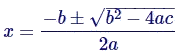
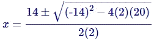

<!---
template: umuc_courses
crsTitle: MATH103 • College Mathematics
--->
    
<h1 id="Week0" class="week">Welcome to MATH103</h1>

This is a classic Face-to-Face class and we meet entirely in person. There will be no online discussions and if you have a question you can ask in class or email me at  

However, I will post all handouts and hyperlinks to videos for the class on this web page which is accessible at the URL 
[rlaurie.pancakeapps.com/math103/](http://rlaurie.pancakeapps.com/math103/).

### So lets get started...

This is a fast paced mathematics course in an 8 week session.

I recommend you allocate approximately 20 hours per week to this course:

 * Lecture = 6 hours per week
 * Optional help session for one hour after each class = 2 hours per week
 * Reading study, video watching, and homework = 12 hours per week or more if you are mathematically challenged

If you have a day job, I recommend that you enroll only in this course this session, because there will be a lot of homework. You should have placed at the MATH012 level before enrolling in this course, or successfully completed MATH009. Unfortunately, UMUC is not enforcing the prerequisite for this course which is MATH012 and unprepared students may feel uncomfortable in this course.  Typically 20% of the students do not pass the first attempt, unless I give you this warning notification so you can properly allocate time for the course. The course has a common final exam for all UMUC sections worldwide. Therefore, I must remain on schedule to cover all topics.  
  
Before the first class, I recommend that you download and print the [MATH103 Course Summary](Math103Summary.pdf  "Right click this link and open in new tab") or latest updated version of the syllabus that can be found in the LEO classroom or at the [UMUC Asia schedule web page](http://webapps.umuc.edu/soc/asia.cfm  "Right click this link and open in new tab"). Also print all Week 1 materials which are posted as PDF files below.

 UMUC has moved to free online resources to support all courses and Will Tenney a UMUC faculty member has written a 433 page eBook titled [***Math for Today's World***](math103ebook.pdf). The eBook is a work in progress and the latest version is available for free download in the [LEO Course Resources](https://campus.umuc.edu/  "Right click this link and open in new tab"). The eBook contains examples and exercises for each section that we will use for the course. Answers to all odd numbered exercises are in the appendix at the end of the book. You are required to do the exercises at the end of each section, that I ask you to do and all will be odd numbered problems so you can check your answer. 

 In the past, students did well with the professionally written textbook *Thinking Mathematically* by Robert Blitzer *5th Edition*, ISBN: 0321645855 [available used from amazon](http://www.amazon.com/Thinking-Mathematically-Fifth-Robert-Blitzer/dp/0321645855/ref=sr_1_1?ie=UTF8&qid=1437573835&sr=8-1&keywords=0321645855 "Right click this link and open in new tab"). If you want to buy a textbook to support the course I would recommend it as it goes into more depth on each topic then the eBook. Used textbooks can be acquired from someone that took the course before or at   [Amazon](http://www.amazon.com/Thinking-Mathematically-Fifth-Robert-Blitzer/dp/0321645855/ref=sr_1_1?ie=UTF8&qid=1437573835&sr=8-1&keywords=0321645855 "Right click this link and open in new tab"). Sample chapters are available for Chapters 5 and 6 in the [LEO Course Resources](https://campus.umuc.edu/ "Right click this link and open in new tab") and examining these chapters will help you through the first two weeks of the course and prepare you for Test 1. 

Please acquire the following items before the first class: 

 * Spiral notebook or ring binder for doing all homework
 * Several pencils or better a 0.7mm mechanical pencil with soft HB graphite
 * Good Eraser
 *  Buy a recommended multi-line display Scientific calculator:  
   - **Texas Instrument TI-36X Pro** [Reference Manual](TI36PRO_Guidebook_EN.pdf "Right click this link and open in new tab") @ AAFES Price = $18.99
   - or Texas Instrument TI-30X IIS (solar) [Reference Manual](TI-30XIIS-B_ReferenceManual.pdf "Right click this link and open in new tab") 
   - or Casio fx-300ES Plus [Reference Manual](fx-300ES_PLUS_EN.pdf "Right click this link and open in new tab")  
   - or Casio fx-115 ES Plus [Reference Manual](fx-115_991ES_PLUS_C_EN.pdf "Right click this link and open in new tab")

I recommend that you get started with Week 1 content today, by clicking Week 1 in the navigation bar above or scrolling down.

Robert Laurie

<h2 id="Week1" class="week">Week 1: Number Theory and the Real Number System</h2>

This week we will be covering Number Theory and the Real Number System which is covered in Math103 eBook Chapter 1. If you downloaded Blitzer Chapter 5 from LEO or acquired the former textbook similar content is in Blitzer Chapter 5 Sections 1-6.
  
It is very important to do all assigned exercises for Chapter 1 so that you have a firm foundation to build upon for the rest of the course. For the first week I have created a Chapter 1 Exercise Solutions handout below which provides more detail then the answer key in the appendix. The focus for the first four weeks of the course is Algebra and links to informative YouTube videos for the Algebra content are displayed below.

Please download and print the following before class this week:

 + Print eBook Chapter 1 if desired. You need to view Chapter 1 content in class so you could view on paper, a notebook computer, iPad, or Kindle tablet device in class. 
 + [Number Line Paper](NumberLines.pdf "Right click this link and open in new tab")
 + [Computer Algebra versus Traditional Algebra Notation](ComputerAlgebra.pdf "Right click this link and open in new tab")
 + [MATH 103 Slide Set 1: Section 1.1-1.2](1.1-2_IntPrimeGcfLcm.pdf "Right click this link and open in new tab")
 + [MATH 103 Slide Set 2: Section 1.3-1.4](1.3-4_RationalIrrational.pdf "Right click this link and open in new tab")
 + [MATH 103 Slide Set 3: Section 1.5](1.5_ExpSciNotation.pdf "Right click this link and open in new tab")
 + [eBook Chapter 1 Exercises Assignment](eBookCh1Asgn.pdf "Right click this link and open in new tab") and my solutions to some of the odd exercises.
	 + Section 1.1 all odd exercises (1 through 75)
	 + Section 1.2 all odd exercises (1 through 21)
	 + Section 1.3 exercises: 1, 5, 9, 13, 17, 21, 25, 29, 33, 37, 41, 45, 49, 53, 57, 61, 65, 69, 73, 77, 81, 85, 89, 93, 97, 101, 103, 105, 107, 109
	 + Section 1.4 all odd exercises (1 through 45)
	 + Section 1.5 all odd exercises (1 through 75)
  
  
### Direct Links to YouTube Videos:

   1. [Prealgebra 7.1b - Changing Percents into Fractions](http://www.youtube.com/watch?v=AurCTt91eaQ "Right click this link and open in new tab")
   1. [Prealgebra 7.1c - Converting Percents and Decimals](http://www.youtube.com/watch?v=x-OOICQsWgs "Right click this link and open in new tab")
   1. [Prealgebra 7.1d - Changing a Fraction into a Percent](http://www.youtube.com/watch?v=IJ0d_VdoUko "Right click this link and open in new tab")
   1. [Algebra 1 2.01a - The Commutative Property](http://www.youtube.com/watch?v=D_WWQNFoRjw "Right click this link and open in new tab")
   1. [Algebra 1 2.01b - The Associative Property](http://www.youtube.com/watch?v=KnTjJCDdNLg "Right click this link and open in new tab")
   1. [Algebra 1 2.03a - Addition of Real Numbers](http://www.youtube.com/watch?v=WzX7cGPPWqo "Right click this link and open in new tab")
   1. [Algebra 1 2.03b - Adding Numbers with Different Signs](http://www.youtube.com/watch?v=SR8e9-AtwPI "Right click this link and open in new tab")
   1. [Algebra 1 2.04a - Subtraction](http://www.youtube.com/watch?v=vcsaR8p8YjU "Right click this link and open in new tab")
   1. [Algebra 1 2.04b - Distributing a Negative Sign](http://www.youtube.com/watch?v=xqDTNA0X-sA "Right click this link and open in new tab")
   1. [Algebra 1 2.05a - The Distributive Property, Part 1](http://www.youtube.com/watch?v=EixCbmu8GiY "Right click this link and open in new tab")
   1. [Algebra 1 2.05b The Distributive Property, Part 2](http://www.youtube.com/watch?v=HuHXj0gQ9AA "Right click this link and open in new tab")
   1. [Algebra 1 2.06a - Properties of Multiplication](http://www.youtube.com/watch?v=_PmnrK8d41k "Right click this link and open in new tab")

Read and reflect on the topic of Math Anxiety which is described on the web page:
[math.about.com/od/reference/a/anxiety.htm](http://math.about.com/od/reference/a/anxiety.htm "Right click this link and open in new tab")

<h2 id="Week2" class="week">Week 2: Algebra: Linear Equations and Inequalities</h2>

This week we will be covering the topics of Algebra of Linear Equations and Inequalities, which is covered in eBook Chapters 2 and 3. If you downloaded Blitzer Chapter 6 from LEO or acquired the former textbook similar content is in Blitzer Chapter 6 Sections 6.1 through 6.4. 

Please download and print the following before class this week:

 + Print eBook Chapter 2 and 3 if desired. You need to view Chapter 2 and 3 content in class so you could view on paper, a notebook computer, iPad, or Kindle tablet device in class. 
 + [MATH 103 Slide Set 4: Chapter 2](2_Algebra.pdf "Right click this link and open in new tab") 
 + [MATH 103 Slide Set 5: Chapter 3](3_WordProblems.pdf "Right click this link and open in new tab")
 + [Answers to odd Exercises](Chapter1-8_Answers.pdf "Right click this link and open in new tab") = 57 pages (from eBook Appendix)
 + [Tentative eBook Exercise Assignments](assignments.md "Right click this link and open in new tab") 
     + Chapter 2 Assignment Exercises
        + Section 2.1: 1, 5, 9, 13, 17, 21, 25, 27, 29
        + Section 2.2: 1, 5, 9, 13, 17, 21, 25, 29, 33, 37, 41, 45, 49, 53, 57
        + Section 2.3: 1, 5, 9, 13, 17, 21, 25, 29, 33, 37
        + Section 2.4: 1, 3, 5, 7, 9, 11, 13, 15
     + Chapter 3 Exercise Assignment
        + Section 3.1: 1, 3, 5, 7, 13, 15 
        + Section 3.2: 1, 3, 7, 11, 13, 15
        + Section 3.3: all odd exercises (1 through 21)
        + Section 3.4: all odd exercises (1 through 45)
        + Section 3.5: 1, 3, 5, 7, 9, 11, 13, 15, 17, 19, 21, 25, 27, 29, 33

### Direct Links to YouTube Videos:

   + [MathTV.com](http://www.mathtv.com/ "Right click this link and open in new tab") view topic list ALGEBRA > Simplifying Expressions.
   + [LucidEducation.com](http://www.lucideducation.com/ "Right click this link and open in new tab") has some good links to Chapter 8 content.
    1. [Algebra 1 6.1a - Simplifying - What You Can and Cannot Cancel](http://www.youtube.com/watch?v=egT87u_pA90 "Right click this link and open in new tab")
    1. [Algebra Review 1.1 - Simplifying Expressions](http://www.youtube.com/watch?v=bDSE411R_O4 "Right click this link and open in new tab")
    1. [Algebra Review 1.2 - Simplifying Expressions](http://www.youtube.com/watch?v=mtd9KiNWHjI "Right click this link and open in new tab")
    1. [Algebra Review 1.3 - Simplifying Expressions](http://www.youtube.com/watch?v=CddKJk6ABsE "Right click this link and open in new tab")
    1. [Algebra Review 2.2 - Solving Equations](http://www.youtube.com/watch?v=GVIFa4Rlehw "Right click this link and open in new tab")
    1. [Algebra Review 2.3 - Solving Equations](http://www.youtube.com/watch?v=p115MGdo8Zk "Right click this link and open in new tab")
    1. [Algebra Review 2.4 - Solving Equations](http://www.youtube.com/watch?v=IVAQqfbfSzc "Right click this link and open in new tab")
    1. [Algebra Review 9.1 - Fractional Equations](http://www.youtube.com/watch?v=EHHIY7q1G3w "Right click this link and open in new tab")
    1. [Algebra Review 9.2 - Fractional Equations](http://www.youtube.com/watch?v=J27pCExbEh0 "Right click this link and open in new tab")
    1. [Algebra Review 9.3 - Fractional Equations](http://www.youtube.com/watch?v=-C4w4QdCqEk "Right click this link and open in new tab")
    1. [Algebra Review 9.4 - Fractional Equations](http://www.youtube.com/watch?v=jll44U8BTXw "Right click this link and open in new tab")
    1. [Prealgebra 7.1b - Changing Percents into Fractions](http://www.youtube.com/watch?v=AurCTt91eaQ "Right click this link and open in new tab")
    1. [Prealgebra 7.1c - Converting Percents and Decimals](http://www.youtube.com/watch?v=x-OOICQsWgs "Right click this link and open in new tab")
    1. [Prealgebra 7.1d - Changing a Fraction into a Percent](http://www.youtube.com/watch?v=IJ0d_VdoUko "Right click this link and open in new tab")
    1. [Prealgebra 7.2a - Solving Percent Exercises - An Introduction](http://www.youtube.com/watch?v=qJ__HlpZJyA "Right click this link and open in new tab")
    1. [Prealgebra 7.2b - How to Solve a Percent Exercise](http://www.youtube.com/watch?v=1cH_PcROWyE "Right click this link and open in new tab")
    1. [Prealgebra 7.3a - Solving Percent Applications](http://www.youtube.com/watch?v=EmFMOtiuP7I "Right click this link and open in new tab")
    1. [Prealgebra 7.3b - Examples of Percentages in Calculations](http://www.youtube.com/watch?v=AWu1dn5GW3M "Right click this link and open in new tab")
    1. [Prealgebra 7.3c - Real World Percentage Examples](http://www.youtube.com/watch?v=PKwrpAFbnTI "Right click this link and open in new tab")

Test 1 is scheduled for next week first class and will cover content from or eBook Chapters 1, 2, and 3  (Blitzer sections 5.1-5.6 and 6.1-6.4). Test 1 is closed book, but you are permitted to bring in one half page of single sided handwritten notes that is 8.5 inches x 5.5 inches. I suggest you simply take a standard letter size paper and fold it in half. You can add to these notes in Test 2 and 3.  You need to bring pencil, eraser, and calculator to Test 1. You may download and view [Sample Test 1](2012S1_test1.tst.pdf "Right click this link and open in new tab") available as a PDF file with answers attached.

<h2 id="Week3" class="week">Week 3: Quadratic Equations, Graphing, and Functions</h2>

This week we will begin with Test 1, which will cover content from eBook Chapters 1, 2, and 3 (Blitzer sections 5.1-5.6 and 6.1-6.4). Test 1 is closed book, but you are permitted to bring in one half page of handwritten notes on one side of an 8.5 inches x 5.5 inches area. I suggest you simply take a standard letter size paper and fold it in half. You can add to these notes for test 2 and 3.  You may download and view [Sample Test 1](2012S1_test1.tst.pdf "Right click this link and open in new tab") available as a PDF file with answers attached.

After Test 1, we will continue with eBook Chapter 4 covering the important topic of Quadratic Equations to include polynomial operations, factoring, and the Quadratic Formula. Blitzer Section 6.5 has similar content coverage.

A quadratic equation is a polynomial equation of the second degree, having the general form:

<figure></figure>
The letters *a*, *b* and *c* are called coefficients: *a* is the coefficient of *x2*, *b* is the coefficient of *x*, and *c* is the constant coefficient. A quadratic equation has two solutions (i.e., solutions for the unknown term *x*). In some cases, these solutions can have the same value. The values of the solutions can be computed using the quadratic formula as shown below:
  
<figure></figure>
For example, the solutions of the quadratic equation

<figure></figure>  
can be determined by first substituting 2 for *a*, -14 for *b*, and 20 for *c* in the quadratic forumula 

<figure></figure>  
and then solving the expression, which gives the solutions of the equation as *x* = 5 and *x* = 2.  

As the week progresses we will cover eBook Chapter 5.1 covering Cartesian coordinate graphing and functions. You will plot points, lines, and functions on graph paper.

Please download and print the following before class this week:

 + Print eBook Chapter 4 and 5 if desired. You need to view Chapter 4 and 5 content in class so you could view on paper, a notebook computer, iPad, or Kindle tablet device in class. 
 + [X-Y Graph Paper 4 per sheet](GraphGrid5x5.pdf "Right click this link and open in new tab") and PRINT 10 copies to bring to class
 + [MATH 103 Slide Set 6: Chapter 4](4_Factoring.pdf "Right click this link and open in new tab") 
 + [MATH 103 Slide Set 7: Chapter 5.1-3](5.1-3_Graphs.pdf "Right click this link and open in new tab") 
 + [Class Notes: Quadratic Equation AC-Method class](Class10.pdf "Right click this link and open in new tab") smart board file
 + [Tentative eBook Exercise Assignments](assignments.md "Right click this link and open in new tab") 
    + Chapter 4 Exercise Assignment
        + Section 4.1: 1, 5, 9, 13, 17, 21, 25, 29, 33
        + Section 4.2: 3, 7, 11, 15, 17, 21, 25, 29, 33, 37, 41, 45, 49, 53, 57, 61, 65, 69, 73, 77, 81, 83, 85
        + Section 4.3: 1, 5, 9, 13, 17
    + Chapter 5 Exercise Assignment
        + Section 5.1: 1, 3, 5, 7, 9, 11, 13, 17, 21, 27, 29, 31, 33, 35, 39

**Geogebra** is a freeware graphing program that can be downloaded and installed from [www.geogebra.org](http://www.geogebra.org "Right click this link and open in new tab"). It is helpful to to be able to graph various mathematical functions using graphing software and to check your homework solutions.

   + [Download and Install Geogebra](https://www.geogebra.org/download "Right click this link and open in new tab") to your computer
   + [Geogebra Web Java App executable in a browser](http://web.geogebra.org/app/#algebra "Right click this link and open in new tab")
   + [My Geogebra video tutorial available here](http://www.screencast.com/users/RobertLaurie/folders/Jing/media/52a1b0a9-33dc-4941-9c43-405ca5cc157a "Right click this link and open in new tab")

### Direct Links to YouTube Videos:

 1. [Prealgebra 10.1a - Introduction to Polynomials](http://www.youtube.com/watch?v=KheuSobDPQ4 "Right click this link and open in new tab")
 1. [Prealgebra 10.1b - Evaluating Polynomials](http://www.youtube.com/watch?v=6wq88RXU_1A "Right click this link and open in new tab")
 1. [Prealgebra 10.2a - Adding and Subtracting Polynomials](http://www.youtube.com/watch?v=m0E8X0s2nSo "Right click this link and open in new tab")
 1. [Prealgebra 10.2b - Adding and Subtracting Polynomials](http://www.youtube.com/watch?v=0vhX7iwSVi0 "Right click this link and open in new tab")
 1. [Prealgebra 10.3a - Multiplying Exponents](http://www.youtube.com/watch?v=2OVBCPrbUvo "Right click this link and open in new tab")
 1. [Prealgebra 10.3b - Raising an Exponent to a Power](http://www.youtube.com/watch?v=BttfwL4VzKc "Right click this link and open in new tab")
 1. [Prealgebra 10.3c - Raising a Product to a Power](http://www.youtube.com/watch?v=aa9HlSi90F0 "Right click this link and open in new tab")
 1. [Prealgebra 10.4a - Multiplying Monomials](http://www.youtube.com/watch?v=cV3xWPyZpQI "Right click this link and open in new tab")
 1. [Prealgebra 10.4b - Multiplying a Monomial and a Polynomial](http://www.youtube.com/watch?v=6lzug5M81FM "Right click this link and open in new tab")
 1. [Prealgebra 10.4c - Multiplying Binomials](http://www.youtube.com/watch?v=n0LL7I95P6A "Right click this link and open in new tab")
 1. [Prealgebra 10.4d - Multiplying Binomials FOIL Method](http://www.youtube.com/watch?v=bumoT28a6TU "Right click this link and open in new tab")
 1. [Prealgebra 10.4e - Multiplying Binomials](http://www.youtube.com/watch?v=laP30X35Fbo "Right click this link and open in new tab")
 1. [Prealgebra 10.5a - Factoring Polynomials](http://www.youtube.com/watch?v=TR9OCUevmzI "Right click this link and open in new tab")
 1. [Prealgebra 10.5b - Factoring Polynomials](http://www.youtube.com/watch?v=yD12cYYDXQQ "Right click this link and open in new tab")
 1. [Prealgebra 10.5c - Factoring Polynomials](http://www.youtube.com/watch?v=lX3eni0luro "Right click this link and open in new tab")
 1. [Algebra Review 4.1 - Factoring](http://www.youtube.com/watch?v=VW4gPOFTpsE "Right click this link and open in new tab") 
 1. [Algebra Review 4.2 - Factoring](http://www.youtube.com/watch?v=ODWvOfgMQVs "Right click this link and open in new tab")
 1. [Prealgebra 9.3a - The Rectangular Coordinate System](http://www.youtube.com/watch?v=uxvs0yhOts0 "Right click this link and open in new tab")
 1. [Prealgebra 9.3b - Coordinates in Two Dimensions](http://www.youtube.com/watch?v=H1aJ8jg-gvo "Right click this link and open in new tab")
 1. [Prealgebra 9.3c - Plotting Points in Two Dimensions](http://www.youtube.com/watch?v=dDPs9Fuzr6o "Right click this link and open in new tab")
 1. [Prealgebra 9.4a - Equations with Two Variables](http://www.youtube.com/watch?v=R5b3LRPnHtY "Right click this link and open in new tab")
 1. [Prealgebra 9.4b - Ordered Pair Solutions to Equations](http://www.youtube.com/watch?v=eR4F2G7HCaE "Right click this link and open in new tab")
 1. [MathTV.com](http://www.mathtv.com/ "Right click this link and open in new tab") Graphing can be viewed at topic list ALGEBRA > Graphing > Lines.
 1. The ac-Method is a very systematic factoring method that allows you to factor trinomial mathematical expressions. Once you understand how to use the ac-method you can usually find the factors much quicker than FOIL. I found several videos on youtube.com covering the ac-Method. Try working out the exercises illustrated in these videos to understand the step-by-step factoring process. Then try it on homework exercises. If you find a different video that is helpful and easy to understand please email me and provide a hyperlink.
  + http://www.youtube.com/watch?v=YUYjttOQL4s
  + http://www.youtube.com/watch?v=AYkaCZUT4O4
  + http://www.youtube.com/watch?v=CH1anZ0XTfY
  
  
  
<h2 id="Week4" class="week">Week 4: Graphing Functions and 2-Variable Equations</h2>

This week we will finish eBook Chapter 5 covering the following topics:

 + Graphing Linear Equations: eBook Section 5.2 (Blitzer section 7.2)
 + Solving Systems of Linear Equations: eBook Section 5.3 (Blitzer section 7.3)
 + Quadratic Functions: eBook Sections 5.4 (Blitzer sub-sections 7.6.5-6)
 + Exponential Functions: eBook Sections 5.5 (Blitzer sub-sections 7.6.1-2)
 + Logarithmic Functions: eBook Sections 5.6 (Blitzer sub-sections 7.6.3-4)
 
Please download and print the following before class this week:

 + Print eBook Chapter 5 if desired. You need to view Chapter 5 content in class so you could view on paper, a notebook computer, iPad, or Kindle tablet device in class. 
 + [X-Y Graph Paper 4 per sheet](GraphGrid5x5.pdf "Right click this link and open in new tab")
 + [Earth Quake and Trajectory Exercises](EarthQuakeAndTrajectoryProblems.pdf "Right click this link and open in new tab")
 + [MATH 103 Slide Set 8: Chapter 5.4-6](5.4-6_Graphs.pdf "Right click this link and open in new tab")
 + [Tentative eBook Exercise Assignments](assignments.md "Right click this link and open in new tab") 
    + Chapter 5 Exercise Assignment
        + Section 5.1: 1, 3, 5, 7, 9, 11, 13, 17, 21, 27, 29, 31, 33, 35, 39
        + Section 5.2: 1, 5, 9, 13, 17, 21, 25, 29, 33, 37, 41, 45, 49
        + Section 5.3: 1, 3, 5, 7, 9, 13, 17, 21, 25, 29, 33, 35, 37, 39
        + Section 5.4: 1, 5, 9, 13, 17, 19, 21, 23
        + Section 5.5: 1, 5, 9, 13, 15, 17
        + Section 5.6: 1, 5, 9, 13, 17, 21, 23
 
**Geogebra** is a freeware graphing program that can be downloaded and installed from [www.geogebra.org](http://www.geogebra.org "Right click this link and open in new tab"). It is helpful to to be able to graph various mathematical functions using graphing software and to check your homework solutions.

 + [Download and Install Geogebra](https://www.geogebra.org/download "Right click this link and open in new tab") to your computer
 + [Geogebra Web Java App executable in a browser](http://web.geogebra.org/app/#algebra "Right click this link and open in new tab")
 + [My Geogebra video tutorial available here](http://www.screencast.com/users/RobertLaurie/folders/Jing/media/52a1b0a9-33dc-4941-9c43-405ca5cc157a "Right click this link and open in new tab")
 + [Geogebra Quickstart Guide](geogebra-quickstart-en-desktop.pdf "Right click this link and open in new tab")
 + [Linear Equation in Slope-Intercept Form](http://tube.geogebra.org/student/m279427 "Right click this link and open in new tab") :: [Geogebra File](LinearEq.ggb "Right click this link and open in new tab")
 + [Graph of Quadratic Equation in Standard form](http://tube.geogebra.org/student/m279237) :: [Geobebra File](QuadraticEqStdForm.ggb "Right click this link and open in new tab")
 + [Graph of Exponential and Logarithm Equations](http://tube.geogebra.org/student/m279333 "Right click this link and open in new tab") :: [Geogebra File](ExponentialEq.ggb "Right click this link and open in new tab")
 
**Test 2** is scheduled for next week first class, and will cover content since the last test in sections from eBook Chapters 4 and 5.  Test 2 is closed book, but you are permitted to bring in one page of single sided handwritten notes that is 8.5 inches x 11 inches.  You need to bring pencil, eraser, and calculator to Test 2. You may download [Sample Test 2](Math103_Exam2_2010S1_sample.pdf "Right click this link and open in new tab") which I used in class last year.

### Direct Links to YouTube Videos:

 + [Prealgebra 9.4b - Ordered Pair Solutions to Equations](http://www.youtube.com/watch?v=eR4F2G7HCaE "Right click this link and open in new tab")
 + [Prealgebra 9.4c - Graphing Linear Equations, Part 1](http://www.youtube.com/watch?v=BgV5UCzPKkk "Right click this link and open in new tab")
 + [Prealgebra 9.4d - Graphing Linear Equations, Part 2](http://www.youtube.com/watch?v=VAJRj8hST1c "Right click this link and open in new tab")
 + [Prealgebra 9.4e - Horizontal and Vertical Lines](http://www.youtube.com/watch?v=KwBE2pJDWvU "Right click this link and open in new tab")
 + [Algebra 2 2.01c - Graphing Functions and the Vertical Line Test](http://www.youtube.com/watch?v=jzNNUuol26Q "Right click this link and open in new tab")
 + [Algebra 2 2.01d - Function Notation](http://youtu.be/S1uAy5vM4HI "Right click this link and open in new tab")

<h2 id="Week5" class="week">Week 5: Financial Mathematics</h2>

**Test 2** will be at the beginning of first class, so do not be late. It will cover content since Test 1.  Test 2 is closed book, but you are permitted to bring in one page of single sided handwritten notes that is 8.5 inches x 11 inches.  You need to bring pencils, eraser, and calculator to Test 2. You may download and try this [Sample Test 2](Math103_Exam2_2010S1_sample.pdf "Right click this link and open in new tab") which I used in class previously.

Financial Mathematics will be the topic this week and after Test 2 we will begin to discuss eBook Chapter 6 (Blitzer Chapter 8) covering the following financial mathematics topics:

 + 6.1 Simple Interest
 + 6.2 Compound Interest
 + 6.3 Annuities
 + 6.4 Mortgages

Please download and print the following before class this week:

 + Print eBook Chapter 6 if desired. You need to view Chapter 6 content in class so you could view on paper, a notebook computer, iPad, or Kindle tablet device in class. 
 + [MATH 103 Slide Set 9: Chapter 6](6_Money.pdf "Right click this link and open in new tab")
 + [Formula Sheet](Math103FormulaSheetP1.pdf "Right click this link and open in new tab") 
 + [Tentative eBook Exercise Assignments](assignments.md "Right click this link and open in new tab") 
    + Chapter 6 Exercise Assignment
       + Section 6.1: 1, 5, 9, 13, 17, 21, 25, 29, 33
       + Section 6.2: 1, 5, 9, 13, 17, 21, 25, 29, 33, 37, 39, 43
       + Section 6.3: 1, 3, 5, 7, 9, 11, 13
       + Section 6.4: 1, 3, 5, 7, 9, 11, 13

### Direct Links to YouTube Videos:

 1. [Prealgebra 7.1b - Changing Percents into Fractions](http://www.youtube.com/watch?v=AurCTt91eaQ "Right click this link and open in new tab")
 1. [Prealgebra 7.1c - Converting Percents and Decimals](http://www.youtube.com/watch?v=x-OOICQsWgs "Right click this link and open in new tab")
 1. [Prealgebra 7.1d - Changing a Fraction into a Percent](http://www.youtube.com/watch?v=IJ0d_VdoUko "Right click this link and open in new tab")
 1. [Prealgebra 7.2a - Solving Percent Exercises - An Introduction](http://www.youtube.com/watch?v=qJ__HlpZJyA "Right click this link and open in new tab")
 1. [Prealgebra 7.2b - How to Solve a Percent Exercise](http://www.youtube.com/watch?v=1cH_PcROWyE "Right click this link and open in new tab")
 1. [Prealgebra 7.3a - Solving Percent Applications](http://www.youtube.com/watch?v=EmFMOtiuP7I "Right click this link and open in new tab")
 1. [Prealgebra 7.3b - Examples of Percentages in Calculations](http://www.youtube.com/watch?v=AWu1dn5GW3M "Right click this link and open in new tab")
 1. [Prealgebra 7.3c - Real World Percentage Examples](http://www.youtube.com/watch?v=PKwrpAFbnTI "Right click this link and open in new tab")

<h2 id="Week6" class="week">Week 6: Probability Theory</h2>

 Probability Theory will be covered this week, with applications to situation analysis, risk tolerance, and gambling. We will be covering the following topics described in eBook Chapter 7 (Blitzer Chapter 11) section numbers:

 + 7.1 Counting Rules 
 + 7.2 Probabilities 
 + 7.3 Complement Rule and Addition Rule
 + 7.4 Multiplication Rule and Conditional Probabilities

Please download and print the following before class this week:

 + Print eBook Chapter 7 if desired. You need to view Chapter 7 content in class so you could view on paper, a notebook computer, iPad, or Kindle tablet device in class. 
 + [MATH 103 Slide Set 10: Chapter 7.1-2](7.1-2_Probability.pdf "Right click this link and open in new tab") 
 + [MATH 103 Slide Set 11: Chapter 7.3-4](7.3-4_Probability.pdf "Right click this link and open in new tab")
 + [Formula Sheet](Math103FormulaSheetP1.pdf "Right click this link and open in new tab") is same as last week
 + [Tentative eBook Exercise Assignments](assignments.md "Right click this link and open in new tab") 
    + Chapter 7 Exercise Assignment
        + Section 7.1: 1, 3, 5, 7, 9, 11, 13, 17, 21, 25, 29, 33, 37, 41, 45, 49
        + Section 7.2: 1, 3, 5, 9, 11, 13, 17, 21, 25, 29, 33, 37, 41, 45, 49, 53, 57, 61
        + Section 7.3: 1, 5, 9, 13, 17, 21, 25, 29, 33, 37, 41, 45, 49
        + Section 7.4: 1, 5, 9, 13, 17, 21, 25, 29, 33, 37, 41, 45, 49, 53, 57, 61, 65, 69

**Test 3** is scheduled for next week, and will cover content since the last test in sections from eBook Chapters 6 and 7.  Test 3 is closed book, but you are permitted to bring in the [Formula Sheet](Math103FormulaSheet.pdf "Right click this link and open in new tab").  You need to bring pencils, eraser, and calculator to Test 3. You may download [Sample Test 3](Math103_Exam3_2012S1.ans.pdf "Right click this link and open in new tab") which I used in class last year and practice.

<h2 id="Week7" class="week">Week 7: Statistics</h2>

**Test 3** will be at the beginning of first class, so do not be late. It will cover content from  eBook Chapters 6 and 7. Test 3 is closed book, but you are permitted to bring in the [Formula Sheet](Math103FormulaSheet.pdf "Right click this link and open in new tab"). You need to bring pencils, eraser, and calculator to Test 3. An example test for [Test 3 with answers can be viewed here](Math103_Exam3_2012S1.ans.pdf "Right click this link and open in new tab").

Statistics will be the topic this week after Test 3.  The Statistics content is in eBook Chapter 8 (Blitzer Chapter 12).

Please download and print the following before class this week:

 + Print eBook Chapter 8 if desired. You need to view Chapter 8 content in class so you could view on paper, a notebook computer, iPad, or Kindle tablet device in class. 
 + [MATH 103 Slide Set 12: Chapter 8](8_Statistics.pdf "Right click this link and open in new tab")
 + [Formula Sheet](Math103FormulaSheetP1.pdf "Right click this link and open in new tab") is same as last week
 + [z-Score Tables](Math103FormulaSheetP23.pdf "Right click this link and open in new tab")
 + [Tentative eBook Exercise Assignments](assignments.md "Right click this link and open in new tab") 
    + Chapter 8 Exercise Assignment
        + Section 8.1: 1, 3, 5, 7, 9, 11, 13, 15, 17, 19
        + Section 8.2: 1, 2, 3, 4, 5, 7, 9, 11, 13, 15, 17, 19, 21, 23, 25, 37, 39, 41, 43
        + Section 8.3: 1, 3, 5, 7, 9, 11, 13, 15, 17, 19, 21, 23, 25
        + Section 8.4: 1, 5, 9, 13, 17, 21, 25, 29, 33, 37, 41, 45, 49, 53, 57, 61, 65
        + Section 8.5: 1, 3, 5, 7, 9, 11 

Your calculator may have a Statistics (STAT) mode that would do the standard deviation calculation after all data values are entered with frequencies. Please consult your Calculator User Manual below:

   - Texas Instrument TI-36X Pro [Reference Manual](TI36PRO_Guidebook_EN.pdf "Right click this link and open in new tab")
   - Texas Instrument TI-30X II  [Reference Manual](TI-30XIIS-B_ReferenceManual.pdf "Right click this link and open in new tab")  
   - Casio fx-300ES Plus [Reference Manual](fx-300ES_PLUS_EN.pdf "Right click this link and open in new tab")  
   - Casio fx-115 ES Plus [Reference Manual](fx-115_991ES_PLUS_C_EN.pdf "Right click this link and open in new tab")  
  
<h2 id="Week8" class="week">Week 8: Final Exam Time</h2>

The Final Exam is the last class of the term. The Final Exam is comprehensive and any material covered in this eight week course may be on the Final Exam. The Final Exam is closed book, but you are permitted to bring in pencils, eraser, calculator, [Formula Sheet](Math103FormulaSheetP1.pdf "Right click this link and open in new tab") and [z-Score Tables](Math103FormulaSheetP23.pdf "Right click this link and open in new tab"). An example [Final Exam](Math%20103%20Practice%20Final%20Exam.pdf "Right click this link and open in new tab") and [Answers](Math 103 Practice Final Exam Solutions.pdf "Right click this link and open in new tab") can be downloaded and viewed here.  

Please bring your notebook contining homework, which I will examine for borderline grade cases. 
Please bring your Tests 1, 2, and 3 to me during the final exam time. I re-examine these tests when determining final grades if you are within a few points of the next grade in the course.

I hope you feel are more comfortable with mathematics after taking this course and you will find it a useful skill when you apply it in life situations. It is your best critical thinking skill to help you make financial decisions. Mathematics is the basis of technology development and understanding physical sciences.

